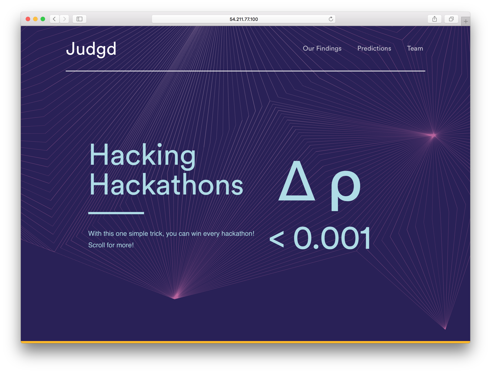
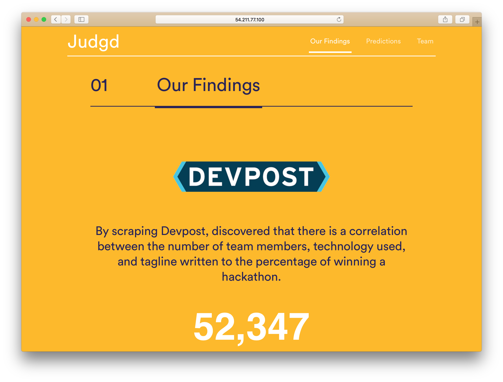
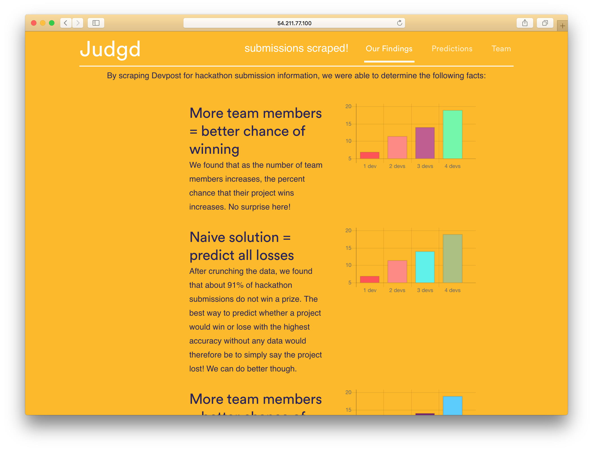
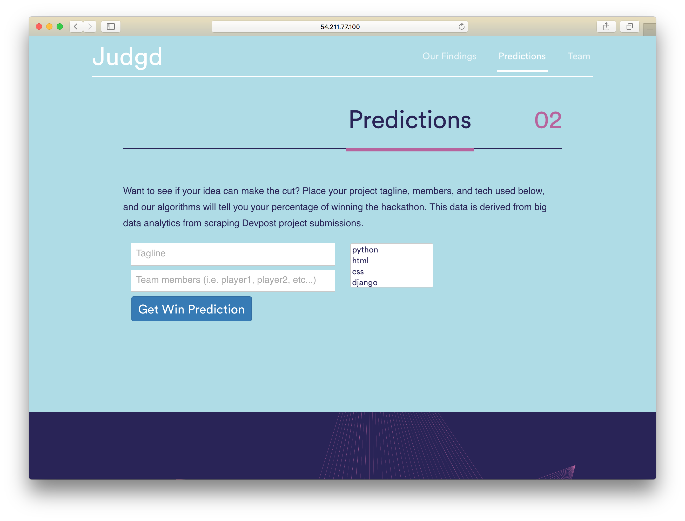

# Judgd - *Deep Learning from Devpost*
A product of [HackGT '16](https://hackgt.com/).

By Aaron Vontell and Cooper Pellaton

## Overview
Aaron and I were wondering what it definitively takes to win a hackathon. As in, is there some means by which you can have a guaranteed at any hackathon if you just pick the right set of technologies and execute on it well?

We found the answer, and it's *yes*. 

So what does this project do? This project starts by scraping every single hackathon project that's ever been put into Devpost and then attempts to derive some value from that information by putting them into a Deep Neural Network (DNN). At the time of this writing the data set that we are working with is ~52,000 projects and ~72,000 Github contributors to these hackathon projects.

We begin by grabbing all of this data, then building a best-fit linear model to it, and then allow you to make some predictions upon which you can test their viability.

Here is a quick visual representation that we put together to show the data set:

## Getting Started
Clone this repository and then begin by running `pip install -r requirements.txt`. This will recurisvely install all of the needed dependecies for the project excluding [TensorFlow](https://www.tensorflow.org/). If you didn't already realize you need to have a system capable of running TensorFlow and or SciKit Learn so head over [here](https://www.tensorflow.org/versions/r0.10/get_started/os_setup.html#download-and-setup) to get everything installed. You also need to have MongoDB installed and running.

Begin by doing the following:
- Open your terminal and open `mongo`.
- Enter `use devpost`
- Enter `db.createCollection("devpost")
- Now exit Mongo shell by using Ctrl-c.
- Open up scraper.py and remove the comment enclosing `get_everything()`.
- Execute `python scraper.py`. Be sure that you are running at least Python version 3.4 or greater.

Let this run until it tells you that there is nothing left to get. At this point *you* own all of the Devpost data. In your MongoDB now presides every single hackathon project ever submitted to an event.

We're now going to do some ML.

## Deriving Value from our Data
Now go back into `scraper.py` and toggle on the following.
1. score = do_some_learning()
2. naive = get_naive_score()
3. logging.info("Score: " + str(score*100.0)+ "%")
4. logging.info("Naive: " + str(naive*100.0) + "%")

This will now let the model run on all of your data and deliver you back some information the success of using a linear regression to predict success vs randomly guessing. What we are hoping for is that `Score` will be `>` than `Naive` but if it isn't, that's okay too, we can always tweak the model later.

**What does this mean?**

Well, it tells us about what wins and what doesn't. At large we know now statistics about what it takes to win a hackathon, so lets try to come up with a winning project.

## Routes Explained
We have the following routes available:

**GET**

1. localhost/stats
2. localhost/naive
3. localhost/tags

**POST**

1. localhost/prediction

## Tips
Our pickle file, `clf.pickle` is the `clf` (otherwise known as the trained neural net) that was derived from 12,000 Devpost projects. If you run the `scraper.py` first without doing a `do_some_learning()` call first, it will be run with our trained data. If you don't have a beefy instance to try and train this set but you want to start to try and fit predictions than this would be the right option for you to choose.

